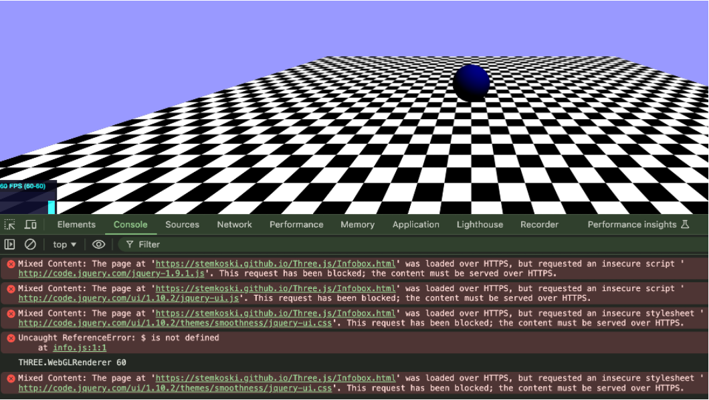

# Revamped Three.js Examples with R171

<!-- ### Welcome to the best game ever created on Roblox! -->

# Description
Three.js examples website (https://stemkoski.github.io/) has served quality source codes for all levels of developers for quick referencing working Three.js codes. However, it's been over a decade since the website's last update, while new Three.js developers looking for fresh starter code, like myself, are emerging every year around the world. I updated some of the stemkoski Three.js sample codes to the latest R171 version, compared to the outdated R60/R58 versions that are still being used. This codebase will provide up-to-date Three.js usages and motivate new developers to contribute more to the latest Three.js technology.

# Link
[https://shkimmie-umb.github.io/threejs_examples_revision/](https://shkimmie-umb.github.io/threejs_examples_revision/)

# Screenshots

# Three.js API analysis
## R58/60 vs. R171, a decade change
* Follow new HTML5 privacy policy.
  * Unwanted autoplay is restricted.
* Follow the modern three.js coding convention
  * Explicit lighting setup; otherwise, objects go completely dark.
  * Position/rotations must be updated explicitly in animate(); otherwise, objects do not move.
  * Vector objects like THREE.Vector3 entail immutability. Values cannot be updated without calling copy() or clone().
  * In MeshPhongMaterial(), texture should be loaded using WebGLCubeRendererTarget(), unlike getting texture from CubeCamera() directly in the older Three.js.
  * Camera position should be explicitly updated in animate().
* Removed obsolete APIs
  * updateCubeMap(renderer, camera) -> update(renderer, camera)
  * CubeGeometry() -> BoxGeometry()
  * new THREE.TrackballControls() -> new TrackballControls()
  * HTTP -> HTTPS

## Example code analysis
[Anaglyph.html](https://shkimmie-umb.github.io/threejs_examples_revision/Three.js_r171/Anaglyph_r171.html)
* Different lighting behavior
  * r60: no explicit lighting definition needed
  * r171: ambientlight, directionalLight must be defined to properly display objects
* Updated Stats widget
  * Old stats:  
  * Newly added stats: 

[Video.html](https://shkimmie-umb.github.io/threejs_examples_revision/Three.js_r171/Video_r171.html) \\
[Many-cameras.html](https://shkimmie-umb.github.io/threejs_examples_revision/Three.js_r171/Many-Cameras_r171.html)
* HTML5 video  autoplay policy changed
  * Video won’t show up unless the user triggers interaction.
  * Security reasons, data consumption, unwanted noise, etc.
* Background color setting policy changed
  * Should set scene.background = new THREE.Color(0x9999ff);
  * Otherwise, the background will be completely dark.

# Challenges / Future Plan
* The Anaglyph effect looks different between old and newer three.js versions (It might be normal due to logic update).
  * 
  * 
* There are some more non-working example codes.
  * [Helpers.html](https://stemkoski.github.io/Three.js/Helpers.html), [~~Video.html~~](https://stemkoski.github.io/Three.js/Video.html) (fixed), [~~Many-Cameras.html~~](https://stemkoski.github.io/Three.js/Many-Cameras.html) (fixed), [LeapMotion.html](https://stemkoski.github.io/Three.js/LeapMotion.html), [~~Sphere-Project.html~~](https://stemkoski.github.io/Three.js/Sphere-Project.html), [Topology-Data-2.html](https://stemkoski.github.io/Three.js/Topology-Data-2.html)
  * There is a lot more to do interesting research on updating old Three.js to newer versions. Please [contact me](mailto:sanghyuk.kim001@umb.edu) anyone is interested in it.